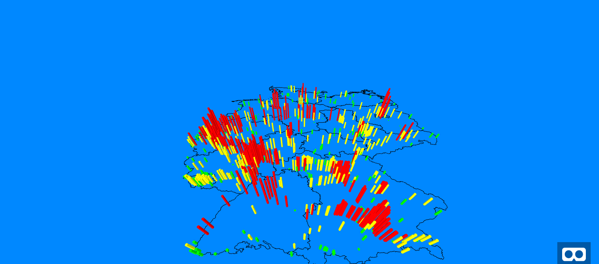

aframe-d3-scenarios
=================

By combining the **aframe-framework** (for virtual reality visualization) and the **d3-framework** (for data processing) I'm visualizing data in 3D. 
The example provided at the index.html shows counting points on German motorways. (https://flofehrenbacher.github.io/aframe-d3-scenarios/)

----------

----------

References
-------------

 - [A-Frame]
 - [D3.js]
 - [aframe-geojson-component]
 - [Daten Zählstellen]

[A-Frame]: https://aframe.io/
[D3.js]: https://d3js.org/
[aframe-geojson-component]: https://github.com/mattrei/aframe-geojson-component
[Daten Zählstellen]: http://www.bast.de/DE/Verkehrstechnik/Fachthemen/v2-verkehrszaehlung/zaehl_node.html
