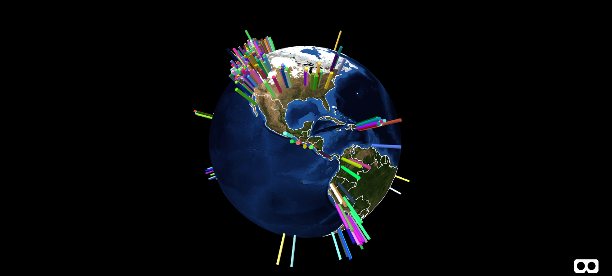

aframe-d3-scenarios
=================

By combining the **aframe-framework** (for virtual reality visualization) and the **d3-framework** (for data processing) I'm visualizing data in 3D.
The examples include showing counting points on German motorways and the earth mapped on a globe including live earthquake data from last week (https://flofehrenbacher.github.io/aframe-d3-scenarios/)

----------

----------

References
-------------

 - [A-Frame]
 - [D3.js]
 - [aframe-geojson-component]
 - [aframe-orbit-controls-component]
 - [Motorway Data]
 - [World GeoJson]
 - [Earthquakes]

[A-Frame]: https://aframe.io/
[D3.js]: https://d3js.org/
[aframe-geojson-component]: https://github.com/mattrei/aframe-geojson-component
[aframe-orbit-controls-component]: https://github.com/tizzle/aframe-orbit-controls-component
[Motorway Data]: http://www.bast.de/DE/Verkehrstechnik/Fachthemen/v2-verkehrszaehlung/zaehl_node.html
[World GeoJson]: https://github.com/johan/world.geo.json
[Earthquakes]: https://earthquake.usgs.gov/
